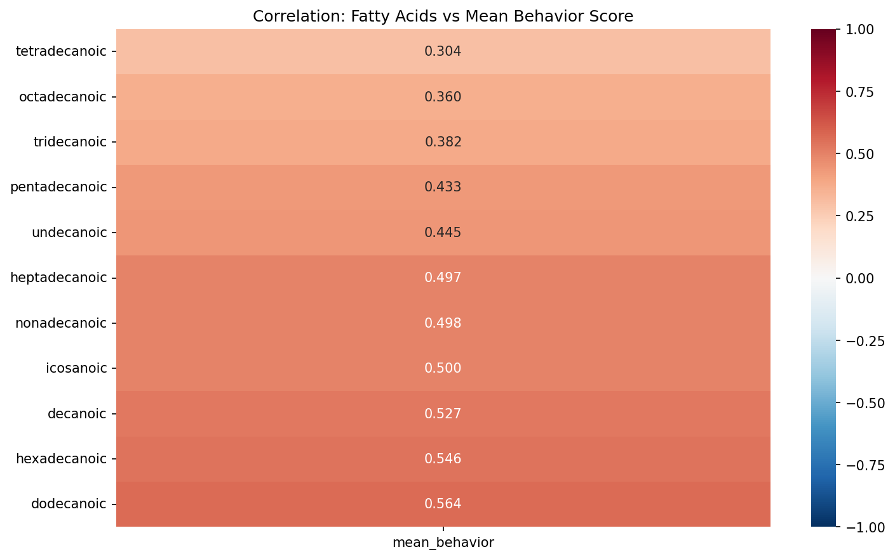
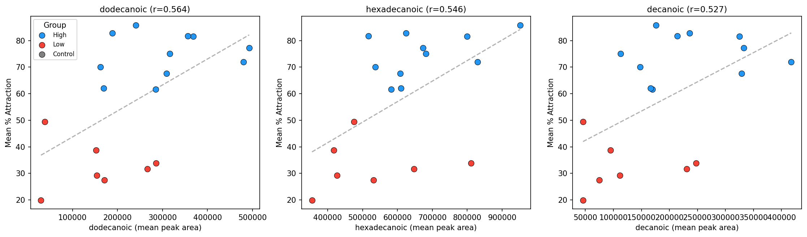
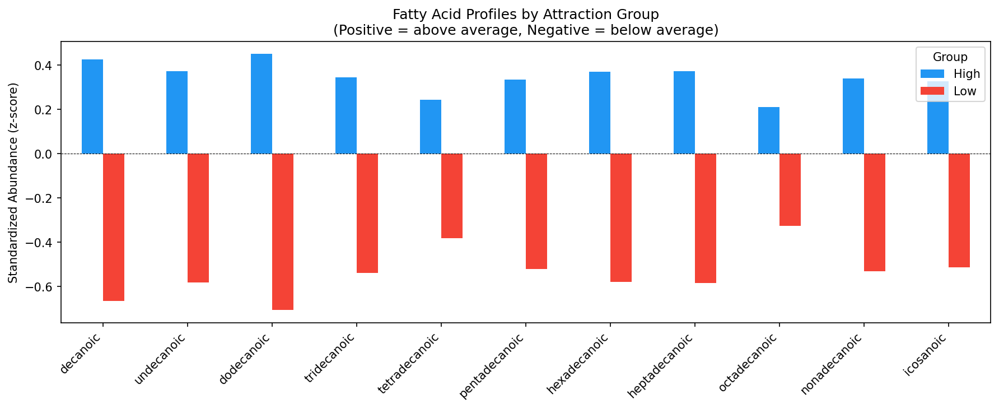
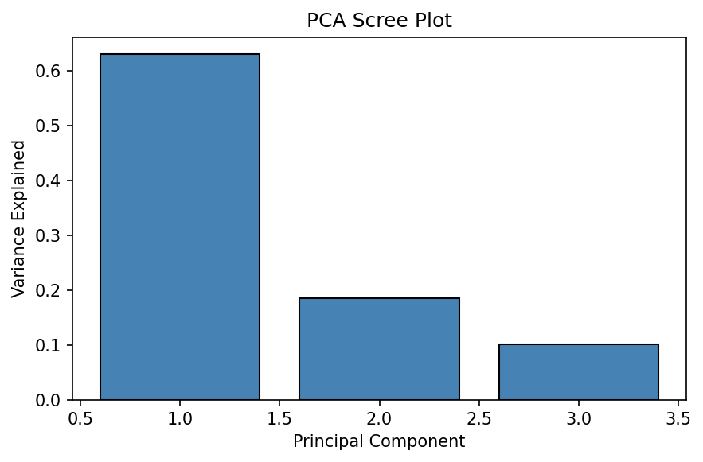
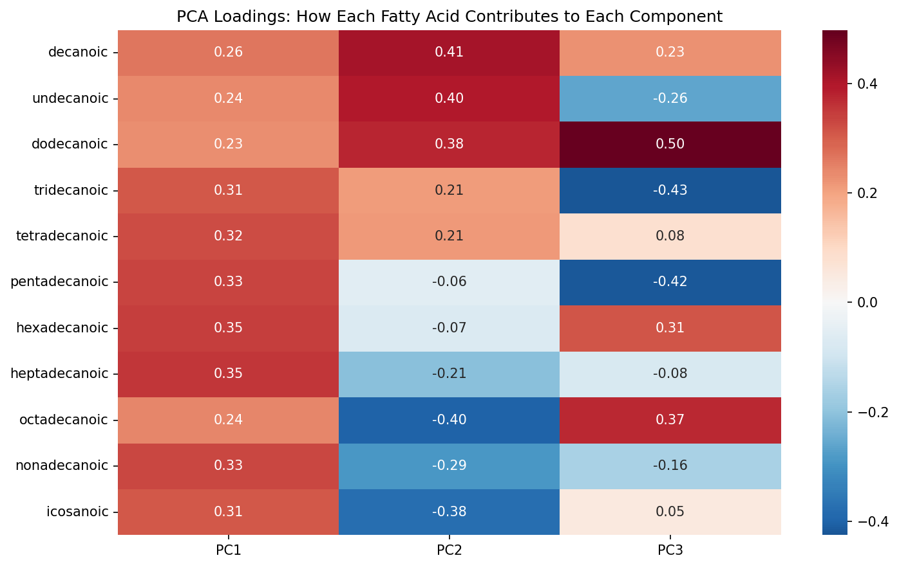
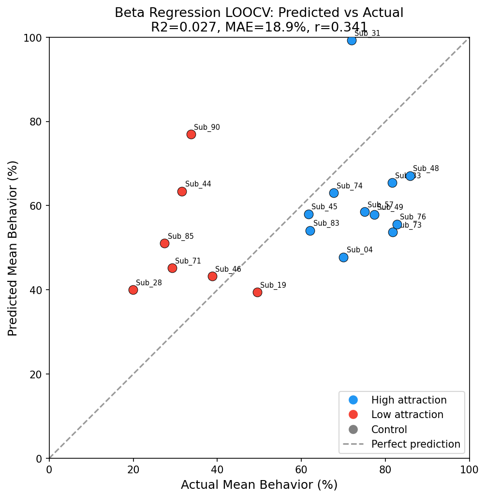
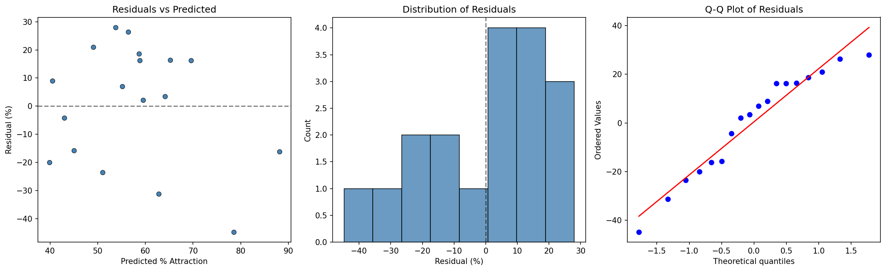
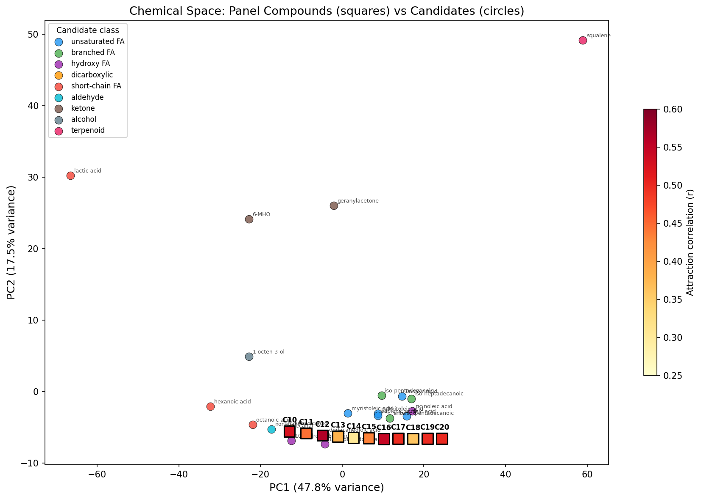
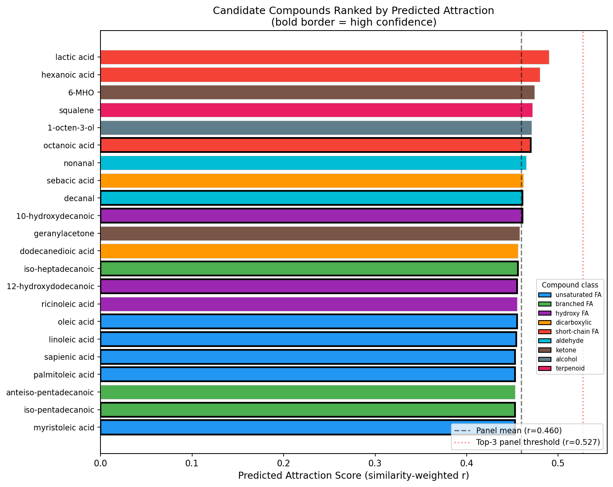
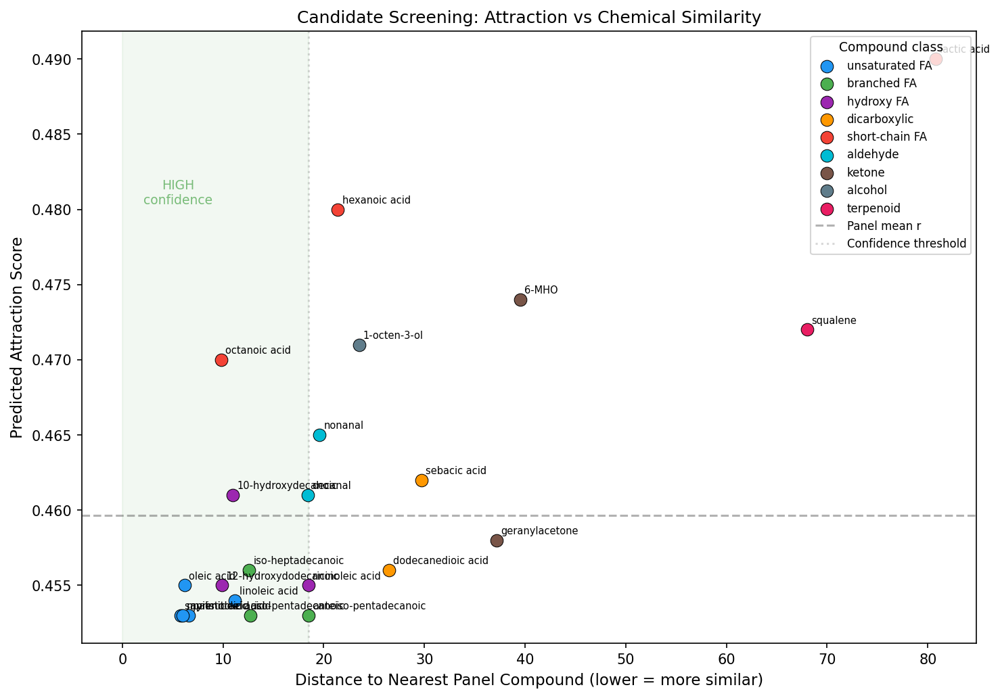

# Predicting Mosquito Attraction from Skin Fatty Acid Profiles

## Question

**Can fatty acid abundances on human skin predict the degree (%) to which a subject attracts mosquitoes?**

Some people are consistently more attractive to mosquitoes than others. This project investigates whether the chemical composition of skin — specifically fatty acid profiles measured by Gas Chromatography-Mass Spectrometry (GC-MS) — can predict behavioral attractiveness to mosquitoes.

We predict **continuous % attraction scores**, not the High/Low binary group labels. The High/Low labels were *derived from* these same scores, so predicting them would be circular. Those labels are used only for visualization.

---

## Data

### Behavior Data (`Behavior_data_Ellen_Fig6B .xlsx`)
- **19 subjects** (11 High attraction, 7 Low attraction, 1 Control)
- Each subject completed **13–26 trials** measuring mosquito attraction (% score per trial)
- Scores range from 0% (no attraction) to 100% (maximum attraction)
- Mean attraction across subjects ranges from **19.9% to 85.8%**

### GC-MS Data (`GCMS_ellen_data_Fig6F.xlsx`)
- **380 rows** (19 subjects × 20 replicate measurements each)
- **11 fatty acids** measured (C10–C20 carbon chain lengths):

| Fatty Acid | Chain | Common Name | Notes |
|---|---|---|---|
| decanoic | C10 | Capric acid | |
| undecanoic | C11 | — | Odd-chain |
| dodecanoic | C12 | Lauric acid | |
| tridecanoic | C13 | — | Odd-chain |
| tetradecanoic | C14 | Myristic acid | |
| pentadecanoic | C15 | — | Odd-chain |
| hexadecanoic | C16 | Palmitic acid | Most abundant |
| heptadecanoic | C17 | Margaric acid | Odd-chain |
| octadecanoic | C18 | Stearic acid | 2nd most abundant |
| nonadecanoic | C19 | — | Odd-chain |
| icosanoic | C20 | Arachidic acid | |

---

## Analysis Overview

All analysis is in [`explore_data.ipynb`](explore_data.ipynb). Two modeling approaches are used:

| Approach | Data | N | Model | Purpose |
|---|---|---|---|---|
| **Subject-level** (Section 4) | Averaged GCMS + averaged behavior | 18 | Beta regression on PCA components | Primary predictive model with LOOCV |
| **Replicate-level** (Section 5) | All 20 GCMS replicates per subject | 360 | Linear mixed-effects model | Properly handles repeated measures |

### Why average?

**Behavior trials** are averaged because each trial is a noisy estimate of the same underlying attractiveness, and the number of trials varies (13–26). **GCMS replicates** are averaged for the subject-level analysis to pair one fatty acid profile with one behavior score. The mixed-effects model (Section 5) keeps all 20 replicates and uses random intercepts per subject to account for within-subject correlation.

### Why beta regression?

The outcome is a **proportion** (0–1). OLS can predict outside [0, 1] and assumes constant variance. Beta regression models the response as Beta-distributed on (0, 1), naturally handling both issues.

### Why PCA?

With **11 correlated fatty acid predictors** and only **18 subjects**, directly fitting regression would be severely overparameterized. PCA reduces the 11 acids to 3 orthogonal components capturing 91.6% of variance, eliminating multicollinearity and making estimation feasible.

---

## Results

### Correlations: Every Fatty Acid Positively Correlates with Attraction

All 11 fatty acids show **positive correlations** with mean % attraction, ranging from r=0.304 (tetradecanoic) to r=0.564 (dodecanoic). Higher fatty acid abundances are broadly associated with greater mosquito attraction.



### Top 3 Individual Fatty Acid Predictors

The strongest individual predictors are dodecanoic (C12), hexadecanoic (C16), and decanoic (C10):



### Group Profiles: High-Attraction Subjects Are Elevated Across All Acids

Comparing standardized (z-scored) fatty acid profiles between High and Low attraction groups shows a consistent pattern: **High attraction subjects have above-average levels of every fatty acid**, while Low attraction subjects are below average across the board.



### PCA: 3 Components Capture 91.6% of Fatty Acid Variance

| Component | Variance | Interpretation |
|---|---|---|
| **PC1** | 62.9% | Overall fatty acid abundance (all loadings positive) |
| **PC2** | 18.5% | Short-chain vs long-chain contrast |
| **PC3** | 10.2% | Specific acid contrasts (dodecanoic/octadecanoic vs tridecanoic/pentadecanoic) |





### Beta Regression: PC1 Significantly Predicts Attraction

The full beta regression model on all 18 subjects:

| Predictor | Coefficient | Std Error | z | p-value |
|---|---|---|---|---|
| **PC1 (overall abundance)** | **0.202** | **0.072** | **2.80** | **0.005** |
| PC2 (chain length contrast) | 0.047 | 0.118 | 0.40 | 0.688 |
| PC3 (specific contrasts) | 0.123 | 0.153 | 0.80 | 0.423 |
| Precision (phi) | 2.045 | 0.317 | 6.44 | 0.000 |

**PC1 is the only significant predictor (p=0.005)**: subjects with higher overall fatty acid levels are more attractive to mosquitoes. The specific composition (which acids are relatively high vs low) does not significantly matter — it's the total amount.

### Leave-One-Out Cross-Validation

LOOCV provides an honest estimate of out-of-sample prediction. PCA is refit inside each fold to prevent data leakage. Beta regression converged in all 18/18 folds.

| Metric | Value | Meaning |
|---|---|---|
| MAE | **17.77%** | Average prediction error |
| RMSE | 20.63% | Penalizes large errors more |
| R-squared (CV) | **0.106** | Variance explained out-of-sample |
| Pearson r | **0.377** | Prediction-outcome correlation |

**Interpretation**: A moderate predictive signal. Predictions correlate with actual scores (r=0.38), explaining ~11% of out-of-sample variance. The gap between in-sample and cross-validated performance reflects the small sample size.



### Residual Diagnostics

Residuals are approximately normally distributed with no systematic patterns, supporting the validity of the model.



### Mixed-Effects Model: Confirms the Pattern

The replicate-level mixed-effects model (`% attraction ~ PC1 + PC2 + PC3 + (1|subject)`) uses all 360 observations. The random intercepts cleanly separate High from Low attraction subjects:

| Subject | Group | Mean % Attraction | Random Intercept |
|---|---|---|---|
| Sub_48 | High | 85.8% | +0.276 |
| Sub_76 | High | 82.7% | +0.245 |
| Sub_33 | High | 81.6% | +0.233 |
| ... | ... | ... | ... |
| Sub_71 | Low | 29.2% | -0.290 |
| Sub_85 | Low | 27.5% | -0.308 |
| Sub_28 | Low | 19.9% | -0.383 |

---

## Chemical Space Screening: Identifying Novel Attractant Candidates

Full analysis in [`qsar_screening.ipynb`](qsar_screening.ipynb).

### Motivation

Our GC-MS panel only measured 11 saturated straight-chain fatty acids (C10–C20). But human skin produces hundreds of volatile compounds — unsaturated acids, branched chains, aldehydes, alcohols, ketones — that weren't in the panel but might also attract mosquitoes. Can we use what we learned from the panel to identify which of these other compounds are worth testing?

### Approach: Molecular Descriptor Similarity Search

We use **Mordred molecular descriptors** to characterize the chemical properties of each compound. Mordred computes ~1600 descriptors from a molecule's SMILES structure, capturing:
- **Topological features**: connectivity, branching, ring structures
- **Physicochemical properties**: molecular weight, LogP (lipophilicity), polar surface area
- **Constitutional descriptors**: atom counts, bond counts, functional group counts
- **Autocorrelation descriptors**: how properties distribute along the molecular graph

Descriptors are computed for all compounds together (panel + candidates), standardized, then reduced to 5 principal components via PCA (capturing 90.4% of variance). This shared chemical space lets us measure how similar each candidate is to the panel compounds.

### What this is NOT

With only 11 training compounds that are structurally very similar (straight-chain saturated acids), we **cannot** train a precise predictive model of attraction from chemical properties alone. The attraction scores don't vary monotonically with chain length or any single descriptor. Instead, this is a **chemical similarity search**: we identify candidates that share chemical features with our top attractors, prioritizing those that are structurally novel but chemically plausible.

### Candidate Library

The 22 candidate compounds are **hand-curated** from the literature, not drawn from a systematic database screen. They represent structurally diverse classes of skin-associated volatiles:

| Class | Compounds | Rationale |
|---|---|---|
| Unsaturated FA | oleic, palmitoleic, linoleic, myristoleic, sapienic | Major sebum components; same chain lengths as panel but with double bonds |
| Branched FA | iso-pentadecanoic, anteiso-pentadecanoic, iso-heptadecanoic | Found in skin lipids; branching alters volatility and receptor binding |
| Hydroxylated FA | 10-hydroxydecanoic, 12-hydroxydodecanoic, ricinoleic | Oxidation products of skin lipids |
| Dicarboxylic | sebacic acid, dodecanedioic acid | Bacterial metabolism products of skin lipids |
| Short-chain FA | octanoic, hexanoic, lactic acid | Lactic acid is a classic mosquito attractant (positive control) |
| Aldehydes | nonanal, decanal | Known mosquito attractants identified in human emanations |
| Ketones | geranylacetone, 6-MHO | Skin volatiles from squalene oxidation |
| Other | 1-octen-3-ol, squalene | Skin-associated alcohol and terpenoid |

In a full implementation, this library could be expanded to thousands of compounds by screening the Human Metabolome Database (HMDB), the Skin Volatiles Database, or targeted subsets of PubChem filtered for skin-relevant physicochemical properties.

### Scoring Method

For each candidate, we compute its Euclidean distance in Mordred PCA space to each panel compound. The predicted attraction score is a **Gaussian kernel-weighted average** of the panel compounds' known attraction correlations:

- Candidates close to **high-attraction** panel compounds (dodecanoic, hexadecanoic, decanoic) score highest
- **Confidence** is based on distance to the nearest panel compound — closer = higher confidence because the candidate is in well-characterized chemical territory

### Chemical Space Map

Panel compounds (squares, colored by attraction strength) form a tight cluster — they're all straight-chain saturated acids varying only in chain length. Candidates spread across a much wider chemical space, with unsaturated and hydroxylated acids closest to the panel and aldehydes/ketones/terpenoids furthest away:



### Candidate Ranking

| Rank | Candidate | Class | Predicted Attraction | Nearest Panel | Confidence |
|---|---|---|---|---|---|
| 1 | octanoic acid | short-chain FA | 0.470 | decanoic | HIGH |
| 2 | 10-hydroxydecanoic | hydroxy FA | 0.461 | decanoic | HIGH |
| 3 | decanal | aldehyde | 0.461 | decanoic | HIGH |
| 4 | iso-heptadecanoic | branched FA | 0.457 | octadecanoic | HIGH |
| 5 | 12-hydroxydodecanoic | hydroxy FA | 0.457 | dodecanoic | HIGH |
| 6 | myristoleic acid | unsaturated FA | 0.457 | tridecanoic | HIGH |
| 7 | oleic acid | unsaturated FA | 0.457 | heptadecanoic | HIGH |
| 8 | palmitoleic acid | unsaturated FA | 0.457 | pentadecanoic | HIGH |
| 9 | sapienic acid | unsaturated FA | 0.457 | pentadecanoic | HIGH |



### Attraction vs Chemical Similarity

The ideal candidates are in the **upper-left**: high predicted attraction AND close to the panel (high confidence). Compounds in the upper-right (lactic acid, hexanoic acid, 6-MHO) have high predicted scores but are chemically distant from the panel — predictions for these are less certain.



### Physicochemical Profile of Top Attractors

The top 3 panel attractors share these properties:

| Property | Range | Interpretation |
|---|---|---|
| **MW** | 172–256 | Medium-weight molecules |
| **LogP** | 3.2–5.6 | Moderately lipophilic (fat-soluble) |
| **TPSA** | 37.3 | Low polar surface area (nonpolar character) |
| **Rotatable bonds** | 8–14 | Flexible chains |
| **FracCSP3** | 0.90–0.94 | Mostly sp3 carbons (saturated) |

High-confidence candidates matching these ranges include:
- **Unsaturated fatty acids** (oleic, palmitoleic, sapienic) — same backbone, added double bond
- **Hydroxylated acids** (10-hydroxydecanoic, 12-hydroxydodecanoic) — same backbone, added OH group
- **Branched-chain acids** (iso-heptadecanoic) — same functional group, altered chain topology

---

## Key Findings

1. **All 11 fatty acids positively correlate with mosquito attraction** — higher levels = more attractive
2. **Overall fatty acid abundance (PC1) is the dominant predictor** (p=0.005) — the total amount matters more than the specific composition
3. **Cross-validated prediction is moderate** (r=0.38, R2=0.11) — a real but modest signal, limited by small sample size (n=18)
4. **High-attraction subjects are uniformly elevated** across all 11 fatty acids compared to low-attraction subjects
5. **The strongest individual predictors** are dodecanoic (C12, r=0.56), hexadecanoic (C16, r=0.55), and decanoic (C10, r=0.53)
6. **Unsaturated and hydroxylated fatty acids** are the top candidates for novel attractants — they share chemical properties with the high-attraction panel compounds while adding structural diversity (double bonds, hydroxyl groups)
7. **Aldehydes** (nonanal, decanal) represent an interesting expansion into different functional group territory, though predictions for these are less confident

---

## Repository Structure

```
Mos_GCMS/
├── README.md                           # This file
├── explore_data.ipynb                  # Beta regression & mixed-effects analysis
├── qsar_screening.ipynb                # Chemical space screening for novel candidates
├── Behavior_data_Ellen_Fig6B .xlsx     # Behavioral assay data (Fig 6B)
├── GCMS_ellen_data_Fig6F.xlsx          # GC-MS fatty acid data (Fig 6F)
├── fig_correlation_heatmap.png         # Fatty acid vs behavior correlations
├── fig_top3_scatter.png                # Top 3 fatty acids scatter plots
├── fig_group_profiles.png              # High vs Low group fatty acid profiles
├── fig_pca_scree.png                   # PCA variance explained
├── fig_pca_loadings.png                # PCA component loadings
├── fig_predicted_vs_actual.png         # LOOCV predictions
├── fig_residuals.png                   # Residual diagnostics
├── fig_chemical_space.png              # Panel vs candidate chemical space
├── fig_candidate_ranking.png           # Candidate attraction ranking
├── fig_attraction_vs_distance.png      # Attraction vs chemical similarity
├── .gitignore                          # Excludes .venv, __pycache__, etc.
└── .venv/                              # Python virtual environment (not tracked)
```

## Setup

```bash
# Load Python (on BU SCC)
module load python3/3.10.12

# Create and activate virtual environment
python3 -m venv .venv
source .venv/bin/activate
pip install pandas openpyxl numpy statsmodels scikit-learn matplotlib seaborn scipy jupyter mordred rdkit-pypi

# Run the notebooks
jupyter notebook explore_data.ipynb
jupyter notebook qsar_screening.ipynb
```
